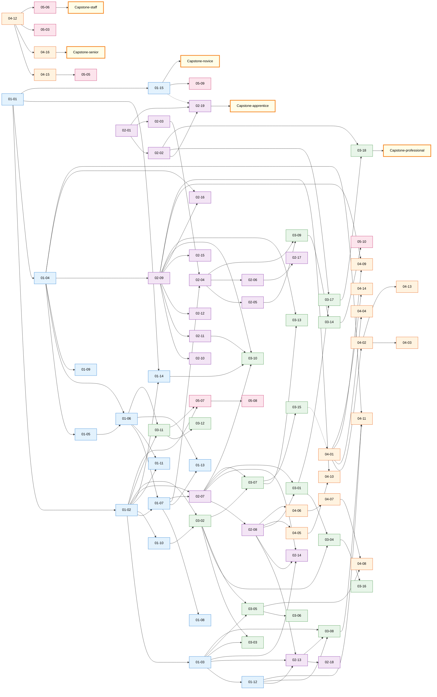

# INDEX — Mapa Global do Framework

> Índice de **todos** os módulos com links e dependências cross-stage. Use isto pra navegar; cada estágio também tem seu README, mas este é o "meta-mapa" único.

---

## Estatísticas

- **5 estágios** (Fundamentos, Plataforma, Professional, Senior, Staff/Principal).
- **78 módulos** (15 Fundamentos + 19 Plataforma + 18 Professional + 16 Senior + 10 Staff) + **5 capstones**.
- **16 metas em `00-meta/`**: INDEX, CAPSTONE-EVOLUTION, CHANGELOG, GLOSSARY, MODULE-TEMPLATE, SELF-ASSESSMENT, INTERVIEW-PREP, ANTIPATTERNS, DECISION-LOG, SPRINT-NEXT, CODEBASE-TOURS, STACK-COMPARISONS, STUDY-PLANS, RELEASE-NOTES, elite-references, reading-list.
- **4 raiz**: README.md, MENTOR.md, PROGRESS.md, STUDY-PROTOCOL.md.

Note: 05-07-05-10 (embedded, hardware, bioinformatics, game dev) são **opcionais** — escolha conforme eixo de carreira.

**Outros documentos vivos**:
- [RELEASE-NOTES.md](RELEASE-NOTES.md) — v1.0 shipping marker; o que está pronto + limitações.
- [SPRINT-NEXT.md](SPRINT-NEXT.md) — backlog priorizado de aprofundamento.
- [STUDY-PLANS.md](STUDY-PLANS.md) — 7 templates de plano por cenário (full-time, part-time, weekend, bootcamp grad, Senior→Staff, career switcher, executive).
- [CODEBASE-TOURS.md](CODEBASE-TOURS.md) — 20 guided reading tours em repos canônicos.
- [STACK-COMPARISONS.md](STACK-COMPARISONS.md) — patterns cross-stack (Node/Java/Python/Ruby/Go/.NET/PHP/Rust/Elixir).

---

## Tabela completa de módulos

### Estágio 1 — Fundamentos (15 + 1 capstone)

| ID | Módulo | Prereqs |
|---|---|---|
| [01-01](../01-fundamentos/01-01-computation-model.md) | Computation Model | — |
| [01-02](../01-fundamentos/01-02-operating-systems.md) | Operating Systems | 01-01 |
| [01-03](../01-fundamentos/01-03-networking.md) | Networking | 01-02 |
| [01-04](../01-fundamentos/01-04-data-structures.md) | Data Structures | 01-01 |
| [01-05](../01-fundamentos/01-05-algorithms.md) | Algorithms | 01-04 |
| [01-06](../01-fundamentos/01-06-programming-paradigms.md) | Programming Paradigms | 01-04, 01-05 |
| [01-07](../01-fundamentos/01-07-javascript-deep.md) | JavaScript Deep | 01-02, 01-06 |
| [01-08](../01-fundamentos/01-08-typescript-type-system.md) | TypeScript Type System | 01-07 |
| [01-09](../01-fundamentos/01-09-git-internals.md) | Git Internals | 01-04 |
| [01-10](../01-fundamentos/01-10-unix-cli-bash.md) | Unix CLI & Bash | 01-02 |
| [01-11](../01-fundamentos/01-11-concurrency-theory.md) | Concurrency Theory | 01-02, 01-06 |
| [01-12](../01-fundamentos/01-12-cryptography-fundamentals.md) | Cryptography Fundamentals | 01-03 |
| [01-13](../01-fundamentos/01-13-compilers-interpreters.md) | Compilers & Interpreters | 01-06, 01-07 |
| [01-14](../01-fundamentos/01-14-cpu-microarchitecture.md) | CPU Microarchitecture | 01-01, 01-02 |
| [01-15](../01-fundamentos/01-15-math-foundations.md) | Math Foundations | 01-01 |
| [CAPSTONE-fundamentos](../01-fundamentos/CAPSTONE-fundamentos.md) | HTTP server from scratch | (estágio 1 completo) |

### Estágio 2 — Plataforma (19 + 1 capstone)

| ID | Módulo | Prereqs |
|---|---|---|
| [02-01](../02-plataforma/02-01-html-css-tailwind.md) | HTML/CSS/Tailwind | — |
| [02-02](../02-plataforma/02-02-accessibility.md) | Accessibility | 02-01 |
| [02-03](../02-plataforma/02-03-dom-web-apis.md) | DOM & Web APIs | 02-01 |
| [02-04](../02-plataforma/02-04-react-deep.md) | React Deep | 02-03, 01-07 |
| [02-05](../02-plataforma/02-05-nextjs.md) | Next.js | 02-04 |
| [02-06](../02-plataforma/02-06-react-native.md) | React Native | 02-04 |
| [02-07](../02-plataforma/02-07-nodejs-internals.md) | Node.js Internals | 01-02, 01-07 |
| [02-08](../02-plataforma/02-08-backend-frameworks.md) | Backend Frameworks | 02-07 |
| [02-09](../02-plataforma/02-09-postgres-deep.md) | Postgres Deep | 01-04 |
| [02-10](../02-plataforma/02-10-orms.md) | ORMs | 02-09 |
| [02-11](../02-plataforma/02-11-redis.md) | Redis | 02-09 |
| [02-12](../02-plataforma/02-12-mongodb.md) | MongoDB | 02-09 |
| [02-13](../02-plataforma/02-13-auth.md) | Auth (OAuth2/JWT) | 02-08, 01-03, 01-12 |
| [02-14](../02-plataforma/02-14-realtime.md) | Real-time (WS/SSE/WebRTC) | 02-07, 02-08, 01-03 |
| [02-15](../02-plataforma/02-15-search-engines.md) | Search Engines & IR | 02-09 |
| [02-16](../02-plataforma/02-16-graph-databases.md) | Graph Databases | 01-04, 02-09 |
| [02-17](../02-plataforma/02-17-native-mobile.md) | Native Mobile (iOS/Android) | 02-06 |
| [02-18](../02-plataforma/02-18-payments-billing.md) | Payments & Billing | 02-13 |
| [02-19](../02-plataforma/02-19-internationalization.md) | i18n / l10n | 02-01, 02-02 |
| [CAPSTONE-plataforma](../02-plataforma/CAPSTONE-plataforma.md) | Logística v1 | (estágio 2 completo) |

### Estágio 3 — Produção (17 + 1 capstone)

| ID | Módulo | Prereqs |
|---|---|---|
| [03-01](../03-producao/03-01-testing.md) | Testing | 02-07, 02-08 |
| [03-02](../03-producao/03-02-docker.md) | Docker | 01-02, 01-10 |
| [03-03](../03-producao/03-03-kubernetes.md) | Kubernetes | 03-02, 01-03 |
| [03-04](../03-producao/03-04-cicd.md) | CI/CD | 03-01, 03-02 |
| [03-05](../03-producao/03-05-aws-core.md) | AWS Core | 01-03, 03-02 |
| [03-06](../03-producao/03-06-iac.md) | IaC | 03-05 |
| [03-07](../03-producao/03-07-observability.md) | Observability | 03-02, 02-07 |
| [03-08](../03-producao/03-08-applied-security.md) | Applied Security (OWASP) | 02-13, 01-03, 01-12 |
| [03-09](../03-producao/03-09-frontend-performance.md) | Frontend Performance | 02-04, 02-05 |
| [03-10](../03-producao/03-10-backend-performance.md) | Backend Performance | 02-07, 02-09, 02-11, 01-14 |
| [03-11](../03-producao/03-11-systems-languages.md) | Systems Languages (Go/Rust) | 01-02, 01-06 |
| [03-12](../03-producao/03-12-webassembly.md) | WebAssembly | 03-11 |
| [03-13](../03-producao/03-13-time-series-analytical-dbs.md) | Time-Series & Analytical DBs | 02-09, 03-07 |
| [03-14](../03-producao/03-14-graphics-audio-codecs.md) | Graphics, Audio & Codecs | 03-09 |
| [03-15](../03-producao/03-15-incident-response.md) | Incident Response & On-Call | 03-07 |
| [03-16](../03-producao/03-16-estimation-planning.md) | Estimation & Planning | 03-04 |
| [03-17](../03-producao/03-17-accessibility-testing.md) | Accessibility Testing & Automation | 02-02, 03-01 |
| [03-18](../03-producao/03-18-cognitive-accessibility.md) | Cognitive Accessibility | 02-02, 03-17 |
| [CAPSTONE-producao](../03-producao/CAPSTONE-producao.md) | Logística v2 | (estágio 3 completo) |

### Estágio 4 — Sistemas (16 + 1 capstone)

| ID | Módulo | Prereqs |
|---|---|---|
| [04-01](../04-sistemas/04-01-distributed-systems-theory.md) | Distributed Systems Theory | (estágio 3 completo) |
| [04-02](../04-sistemas/04-02-messaging.md) | Messaging (Kafka/RabbitMQ) | 04-01 |
| [04-03](../04-sistemas/04-03-event-driven-patterns.md) | Event-Driven Patterns | 04-02 |
| [04-04](../04-sistemas/04-04-resilience-patterns.md) | Resilience Patterns | 04-01 |
| [04-05](../04-sistemas/04-05-api-design.md) | API Design Avançado | 02-08 |
| [04-06](../04-sistemas/04-06-domain-driven-design.md) | Domain-Driven Design | 02-08 |
| [04-07](../04-sistemas/04-07-architectures.md) | Architectures (Hex/Clean/VS/Modular) | 04-06 |
| [04-08](../04-sistemas/04-08-services-monolith-serverless.md) | Services vs Monolith vs Serverless | 04-07, 03-05 |
| [04-09](../04-sistemas/04-09-scaling.md) | Scaling | 04-01, 02-09 |
| [04-10](../04-sistemas/04-10-ai-llm.md) | AI/LLM em Sistemas | 04-05, 02-09 |
| [04-11](../04-sistemas/04-11-web3.md) | Web3 / Blockchain | 01-04, 03-08, 01-12 |
| [04-12](../04-sistemas/04-12-tech-leadership.md) | Tech Leadership | (qualquer) |
| [04-13](../04-sistemas/04-13-streaming-batch-processing.md) | Streaming & Batch Processing | 04-02 |
| [04-14](../04-sistemas/04-14-formal-methods.md) | Formal Methods (TLA+) | 04-01 |
| [04-15](../04-sistemas/04-15-oss-maintainership.md) | OSS Maintainership | 04-12 |
| [04-16](../04-sistemas/04-16-product-business-economics.md) | Product, Business & Unit Economics | 04-12 |
| [CAPSTONE-sistemas](../04-sistemas/CAPSTONE-sistemas.md) | Logística v3 | (estágio 4 completo) |

### Estágio 5 — Amplitude (7 + 1 capstone)

| ID | Módulo | Prereqs |
|---|---|---|
| [05-01](../05-amplitude/05-01-build-from-scratch-track.md) | Build-from-Scratch Track | (estágio 4 completo) |
| [05-02](../05-amplitude/05-02-multi-domain-capstones.md) | Multi-Domain Capstones | (estágio 4 completo) |
| [05-03](../05-amplitude/05-03-conways-law-org-architecture.md) | Conway's Law & Org Architecture | 04-12 |
| [05-04](../05-amplitude/05-04-paper-reading-research.md) | Paper Reading & Research | (estágio 4 completo) |
| [05-05](../05-amplitude/05-05-public-output.md) | Public Output | 04-15 |
| [05-06](../05-amplitude/05-06-mentorship-at-scale.md) | Mentorship at Scale | 04-12 |
| [05-07](../05-amplitude/05-07-embedded-iot.md) | Embedded & IoT (opcional) | 01-02, 03-11 |
| [05-08](../05-amplitude/05-08-hardware-design.md) | Hardware Design Fundamentals (opcional) | 05-07 |
| [05-09](../05-amplitude/05-09-bioinformatics-scientific-computing.md) | Bioinformatics & Scientific Computing (opcional) | 01-15 |
| [05-10](../05-amplitude/05-10-game-development-pipeline.md) | Game Development Pipeline (opcional) | 03-14 |
| [CAPSTONE-amplitude](../05-amplitude/CAPSTONE-amplitude.md) | Specialization Track + Portfolio + Promo Case | 05-01-05-06 |

---

## Dependency DAG (cross-stage com edges reais)

Edges respeitam **prereqs declarados em frontmatter** de cada módulo. Cross-stage edges (ex: 02-13→03-08, 01-12→04-11) são as conexões mais importantes — elas mostram que prerequisitos atravessam estágio.

**Legenda das edges**:
- Linha sólida = prereq direto.
- Linha tracejada (`-.->`)= dependência fraca / recomendação (não bloqueante mas relevante).

**Cross-stage edges relevantes** (saber estes ajuda planejar trilha):
- `01-12 → 02-13`: Auth depende de cripto fundamentals.
- `01-12 → 03-08`: Security aplicado depende de cripto.
- `01-12 → 04-11`: Web3 obriga cripto sólida.
- `01-14 → 03-10`: backend perf precisa CPU microarch.
- `01-15 → 02-19`: i18n + Unicode tem aspectos formais.
- `01-15 → 05-09`: scientific computing exige math.
- `02-02 → 03-17 → 03-18`: a11y básico → automated → cognitive.
- `02-07/02-08 → 03-01`: testing precisa Node + framework.
- `02-09 → 04-09/04-10/04-13`: Postgres é base de scaling, AI vector, streaming.
- `03-11 → 05-07/05-08`: systems languages habilita embedded e hardware.
- `03-15 → 04-01`: experience operacional ajuda entender distributed.

---

---

## Trilhas paralelas recomendadas

Você não precisa seguir um módulo por vez. Trilhas paralelas dentro de estágio:

**Fundamentos**:
- Trilha foundations: 01-01 → 01-02 → 01-03 → 01-04 → 01-05 → 01-06.
- Trilha JS: 01-07 → 01-08.
- Trilha tooling: 01-09, 01-10 (paralelo).
- Trilha advanced: 01-11, 01-12, 01-13, 01-14, 01-15 (após base).

**Plataforma**:
- Frontend: 02-01 → 02-02 → 02-03 → 02-04 → 02-05 → 02-06 → 02-17 → 02-19.
- Backend: 02-07 → 02-08 → 02-13 → 02-14 → 02-18.
- Dados: 02-09 → 02-10 → 02-11 → 02-12 → 02-15 → 02-16.

**Produção**:
- Operações: 03-02 → 03-03 → 03-04 → 03-05 → 03-06 → 03-07 → 03-15.
- Qualidade: 03-01 → 03-08 → 03-09 → 03-10 → 03-17.
- Sistemas: 03-11 → 03-12.
- Dados: 03-13 → 03-14.
- Soft technical: 03-16.

**Sistemas**:
- Distribuído: 04-01 → 04-02 → 04-03 → 04-04 → 04-09 → 04-13.
- Design: 04-05 → 04-06 → 04-07 → 04-08.
- Rigor: 04-14 (paralelo).
- Avançado: 04-10, 04-11, 04-12.
- Carreira: 04-15 → 04-16.

**Amplitude**:
- Núcleo técnico: 05-01, 05-02 (paralelo, longo).
- Influência: 05-03, 05-05, 05-06 (running disciplines).
- Hábito: 05-04.
- Opcional: 05-07.

---

## Cross-cutting topics (mesmo tema em vários módulos)

Alguns assuntos atravessam estágios. Use estas listas pra busca temática:

**Concorrência**:
- 01-02 (threads, processes), 01-07 (event loop), **01-11** (theory), 02-07 (Node), 02-11 (Redis single-thread), 03-10 (perf), 03-11 (Go/Rust), 04-04 (resilience).

**Cripto/Segurança**:
- **01-12** (foundations), 02-13 (auth), 03-08 (OWASP), 01-03 (TLS), 04-11 (Web3).

**Performance**:
- **01-14** (CPU), 01-04/01-05 (algoritmos), 03-09 (frontend), 03-10 (backend), 03-13 (analytical), 03-14 (graphics).

**Distribuído**:
- 04-01 (theory), 04-02 (messaging), 04-03 (event-driven), 04-04 (resilience), 04-09 (scaling), 04-13 (streaming), **04-14** (formal).

**ML/LLM**:
- 01-15 (math), 02-15 (search/embeddings), 04-10 (LLM systems), 05-02 (RAG capstone).

**Carreira/Influência**:
- 04-12 (leadership), 04-15 (OSS), 04-16 (business), 05-03 (org), 05-05 (output), 05-06 (mentorship).

**Capstone único — Logística**:
- CAPSTONE-fundamentos (HTTP server), CAPSTONE-plataforma (v1), CAPSTONE-producao (v2), CAPSTONE-sistemas (v3), CAPSTONE-amplitude (specialization). Ver [CAPSTONE-EVOLUTION.md](CAPSTONE-EVOLUTION.md).

---

## Como usar este índice

- **Ao iniciar sessão**: o mentor usa pra confirmar próximo módulo legítimo (prereqs satisfeitos).
- **Ao planejar trilha**: você decide ordem dentro de estágio respeitando prereqs.
- **Ao buscar tema**: cross-cutting topics te poupa minutos.
- **Ao estudar paper / problema novo**: ache módulo conectado pra base teórica.
- **Em entrevista futura**: revise módulos relacionados ao role-target.

---

**Fim do índice.** Atualize quando adicionar módulos novos. Mantenha simples — este é mapa, não livro.
