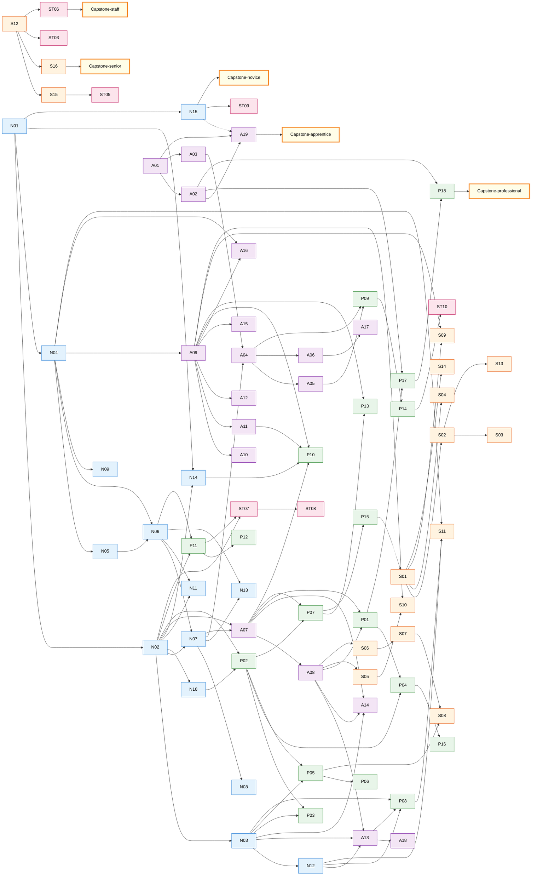

# INDEX — Mapa Global do Framework

> Índice de **todos** os módulos com links e dependências cross-stage. Use isto pra navegar; cada estágio também tem seu README, mas este é o "meta-mapa" único.

---

## Estatísticas

- **5 estágios** (Novice, Apprentice, Professional, Senior, Staff/Principal).
- **78 módulos** (15 Novice + 19 Apprentice + 18 Professional + 16 Senior + 10 Staff) + **5 capstones**.
- **16 metas em `00-meta/`**: INDEX, CAPSTONE-EVOLUTION, CHANGELOG, GLOSSARY, MODULE-TEMPLATE, SELF-ASSESSMENT, INTERVIEW-PREP, ANTIPATTERNS, DECISION-LOG, SPRINT-NEXT, CODEBASE-TOURS, STACK-COMPARISONS, STUDY-PLANS, RELEASE-NOTES, elite-references, reading-list.
- **4 raiz**: README.md, MENTOR.md, PROGRESS.md, STUDY-PROTOCOL.md.

Note: ST07-ST10 (embedded, hardware, bioinformatics, game dev) são **opcionais** — escolha conforme eixo de carreira.

**Outros documentos vivos**:
- [RELEASE-NOTES.md](RELEASE-NOTES.md) — v1.0 shipping marker; o que está pronto + limitações.
- [SPRINT-NEXT.md](SPRINT-NEXT.md) — backlog priorizado de aprofundamento.
- [STUDY-PLANS.md](STUDY-PLANS.md) — 7 templates de plano por cenário (full-time, part-time, weekend, bootcamp grad, Senior→Staff, career switcher, executive).
- [CODEBASE-TOURS.md](CODEBASE-TOURS.md) — 20 guided reading tours em repos canônicos.
- [STACK-COMPARISONS.md](STACK-COMPARISONS.md) — patterns cross-stack (Node/Java/Python/Ruby/Go/.NET/PHP/Rust/Elixir).

---

## Tabela completa de módulos

### Estágio 1 — Novice (15 + 1 capstone)

| ID | Módulo | Prereqs |
|---|---|---|
| [N01](../01-novice/N01-computation-model.md) | Computation Model | — |
| [N02](../01-novice/N02-operating-systems.md) | Operating Systems | N01 |
| [N03](../01-novice/N03-networking.md) | Networking | N02 |
| [N04](../01-novice/N04-data-structures.md) | Data Structures | N01 |
| [N05](../01-novice/N05-algorithms.md) | Algorithms | N04 |
| [N06](../01-novice/N06-programming-paradigms.md) | Programming Paradigms | N04, N05 |
| [N07](../01-novice/N07-javascript-deep.md) | JavaScript Deep | N02, N06 |
| [N08](../01-novice/N08-typescript-type-system.md) | TypeScript Type System | N07 |
| [N09](../01-novice/N09-git-internals.md) | Git Internals | N04 |
| [N10](../01-novice/N10-unix-cli-bash.md) | Unix CLI & Bash | N02 |
| [N11](../01-novice/N11-concurrency-theory.md) | Concurrency Theory | N02, N06 |
| [N12](../01-novice/N12-cryptography-fundamentals.md) | Cryptography Fundamentals | N03 |
| [N13](../01-novice/N13-compilers-interpreters.md) | Compilers & Interpreters | N06, N07 |
| [N14](../01-novice/N14-cpu-microarchitecture.md) | CPU Microarchitecture | N01, N02 |
| [N15](../01-novice/N15-math-foundations.md) | Math Foundations | N01 |
| [CAPSTONE-novice](../01-novice/CAPSTONE-novice.md) | HTTP server from scratch | (Novice completo) |

### Estágio 2 — Apprentice (19 + 1 capstone)

| ID | Módulo | Prereqs |
|---|---|---|
| [A01](../02-apprentice/A01-html-css-tailwind.md) | HTML/CSS/Tailwind | — |
| [A02](../02-apprentice/A02-accessibility.md) | Accessibility | A01 |
| [A03](../02-apprentice/A03-dom-web-apis.md) | DOM & Web APIs | A01 |
| [A04](../02-apprentice/A04-react-deep.md) | React Deep | A03, N07 |
| [A05](../02-apprentice/A05-nextjs.md) | Next.js | A04 |
| [A06](../02-apprentice/A06-react-native.md) | React Native | A04 |
| [A07](../02-apprentice/A07-nodejs-internals.md) | Node.js Internals | N02, N07 |
| [A08](../02-apprentice/A08-backend-frameworks.md) | Backend Frameworks | A07 |
| [A09](../02-apprentice/A09-postgres-deep.md) | Postgres Deep | N04 |
| [A10](../02-apprentice/A10-orms.md) | ORMs | A09 |
| [A11](../02-apprentice/A11-redis.md) | Redis | A09 |
| [A12](../02-apprentice/A12-mongodb.md) | MongoDB | A09 |
| [A13](../02-apprentice/A13-auth.md) | Auth (OAuth2/JWT) | A08, N03, N12 |
| [A14](../02-apprentice/A14-realtime.md) | Real-time (WS/SSE/WebRTC) | A07, A08, N03 |
| [A15](../02-apprentice/A15-search-engines.md) | Search Engines & IR | A09 |
| [A16](../02-apprentice/A16-graph-databases.md) | Graph Databases | N04, A09 |
| [A17](../02-apprentice/A17-native-mobile.md) | Native Mobile (iOS/Android) | A06 |
| [A18](../02-apprentice/A18-payments-billing.md) | Payments & Billing | A13 |
| [A19](../02-apprentice/A19-internationalization.md) | i18n / l10n | A01, A02 |
| [CAPSTONE-apprentice](../02-apprentice/CAPSTONE-apprentice.md) | Logística v1 | (Apprentice completo) |

### Estágio 3 — Professional (17 + 1 capstone)

| ID | Módulo | Prereqs |
|---|---|---|
| [P01](../03-professional/P01-testing.md) | Testing | A07, A08 |
| [P02](../03-professional/P02-docker.md) | Docker | N02, N10 |
| [P03](../03-professional/P03-kubernetes.md) | Kubernetes | P02, N03 |
| [P04](../03-professional/P04-cicd.md) | CI/CD | P01, P02 |
| [P05](../03-professional/P05-aws-core.md) | AWS Core | N03, P02 |
| [P06](../03-professional/P06-iac.md) | IaC | P05 |
| [P07](../03-professional/P07-observability.md) | Observability | P02, A07 |
| [P08](../03-professional/P08-applied-security.md) | Applied Security (OWASP) | A13, N03, N12 |
| [P09](../03-professional/P09-frontend-performance.md) | Frontend Performance | A04, A05 |
| [P10](../03-professional/P10-backend-performance.md) | Backend Performance | A07, A09, A11, N14 |
| [P11](../03-professional/P11-systems-languages.md) | Systems Languages (Go/Rust) | N02, N06 |
| [P12](../03-professional/P12-webassembly.md) | WebAssembly | P11 |
| [P13](../03-professional/P13-time-series-analytical-dbs.md) | Time-Series & Analytical DBs | A09, P07 |
| [P14](../03-professional/P14-graphics-audio-codecs.md) | Graphics, Audio & Codecs | P09 |
| [P15](../03-professional/P15-incident-response.md) | Incident Response & On-Call | P07 |
| [P16](../03-professional/P16-estimation-planning.md) | Estimation & Planning | P04 |
| [P17](../03-professional/P17-accessibility-testing.md) | Accessibility Testing & Automation | A02, P01 |
| [P18](../03-professional/P18-cognitive-accessibility.md) | Cognitive Accessibility | A02, P17 |
| [CAPSTONE-professional](../03-professional/CAPSTONE-professional.md) | Logística v2 | (Professional completo) |

### Estágio 4 — Senior (16 + 1 capstone)

| ID | Módulo | Prereqs |
|---|---|---|
| [S01](../04-senior/S01-distributed-systems-theory.md) | Distributed Systems Theory | (Professional completo) |
| [S02](../04-senior/S02-messaging.md) | Messaging (Kafka/RabbitMQ) | S01 |
| [S03](../04-senior/S03-event-driven-patterns.md) | Event-Driven Patterns | S02 |
| [S04](../04-senior/S04-resilience-patterns.md) | Resilience Patterns | S01 |
| [S05](../04-senior/S05-api-design.md) | API Design Avançado | A08 |
| [S06](../04-senior/S06-domain-driven-design.md) | Domain-Driven Design | A08 |
| [S07](../04-senior/S07-architectures.md) | Architectures (Hex/Clean/VS/Modular) | S06 |
| [S08](../04-senior/S08-services-monolith-serverless.md) | Services vs Monolith vs Serverless | S07, P05 |
| [S09](../04-senior/S09-scaling.md) | Scaling | S01, A09 |
| [S10](../04-senior/S10-ai-llm.md) | AI/LLM em Sistemas | S05, A09 |
| [S11](../04-senior/S11-web3.md) | Web3 / Blockchain | N04, P08, N12 |
| [S12](../04-senior/S12-tech-leadership.md) | Tech Leadership | (qualquer) |
| [S13](../04-senior/S13-streaming-batch-processing.md) | Streaming & Batch Processing | S02 |
| [S14](../04-senior/S14-formal-methods.md) | Formal Methods (TLA+) | S01 |
| [S15](../04-senior/S15-oss-maintainership.md) | OSS Maintainership | S12 |
| [S16](../04-senior/S16-product-business-economics.md) | Product, Business & Unit Economics | S12 |
| [CAPSTONE-senior](../04-senior/CAPSTONE-senior.md) | Logística v3 | (Senior completo) |

### Estágio 5 — Staff / Principal (7 + 1 capstone)

| ID | Módulo | Prereqs |
|---|---|---|
| [ST01](../05-staff/ST01-build-from-scratch-track.md) | Build-from-Scratch Track | (Senior completo) |
| [ST02](../05-staff/ST02-multi-domain-capstones.md) | Multi-Domain Capstones | (Senior completo) |
| [ST03](../05-staff/ST03-conways-law-org-architecture.md) | Conway's Law & Org Architecture | S12 |
| [ST04](../05-staff/ST04-paper-reading-research.md) | Paper Reading & Research | (Senior completo) |
| [ST05](../05-staff/ST05-public-output.md) | Public Output | S15 |
| [ST06](../05-staff/ST06-mentorship-at-scale.md) | Mentorship at Scale | S12 |
| [ST07](../05-staff/ST07-embedded-iot.md) | Embedded & IoT (opcional) | N02, P11 |
| [ST08](../05-staff/ST08-hardware-design.md) | Hardware Design Fundamentals (opcional) | ST07 |
| [ST09](../05-staff/ST09-bioinformatics-scientific-computing.md) | Bioinformatics & Scientific Computing (opcional) | N15 |
| [ST10](../05-staff/ST10-game-development-pipeline.md) | Game Development Pipeline (opcional) | P14 |
| [CAPSTONE-staff](../05-staff/CAPSTONE-staff.md) | Specialization Track + Portfolio + Promo Case | ST01-ST06 |

---

## Dependency DAG (cross-stage com edges reais)

Edges respeitam **prereqs declarados em frontmatter** de cada módulo. Cross-stage edges (ex: A13→P08, N12→S11) são as conexões mais importantes — elas mostram que prerequisitos atravessam estágio.

**Legenda das edges**:
- Linha sólida = prereq direto.
- Linha tracejada (`-.->`)= dependência fraca / recomendação (não bloqueante mas relevante).

**Cross-stage edges relevantes** (saber estes ajuda planejar trilha):
- `N12 → A13`: Auth depende de cripto fundamentals.
- `N12 → P08`: Security aplicado depende de cripto.
- `N12 → S11`: Web3 obriga cripto sólida.
- `N14 → P10`: backend perf precisa CPU microarch.
- `N15 → A19`: i18n + Unicode tem aspectos formais.
- `N15 → ST09`: scientific computing exige math.
- `A02 → P17 → P18`: a11y básico → automated → cognitive.
- `A07/A08 → P01`: testing precisa Node + framework.
- `A09 → S09/S10/S13`: Postgres é base de scaling, AI vector, streaming.
- `P11 → ST07/ST08`: systems languages habilita embedded e hardware.
- `P15 → S01`: experience operacional ajuda entender distributed.

---

---

## Trilhas paralelas recomendadas

Você não precisa seguir um módulo por vez. Trilhas paralelas dentro de estágio:

**Novice**:
- Trilha foundations: N01 → N02 → N03 → N04 → N05 → N06.
- Trilha JS: N07 → N08.
- Trilha tooling: N09, N10 (paralelo).
- Trilha advanced: N11, N12, N13, N14, N15 (após base).

**Apprentice**:
- Frontend: A01 → A02 → A03 → A04 → A05 → A06 → A17 → A19.
- Backend: A07 → A08 → A13 → A14 → A18.
- Dados: A09 → A10 → A11 → A12 → A15 → A16.

**Professional**:
- Operações: P02 → P03 → P04 → P05 → P06 → P07 → P15.
- Qualidade: P01 → P08 → P09 → P10 → P17.
- Sistemas: P11 → P12.
- Dados: P13 → P14.
- Soft technical: P16.

**Senior**:
- Distribuído: S01 → S02 → S03 → S04 → S09 → S13.
- Design: S05 → S06 → S07 → S08.
- Rigor: S14 (paralelo).
- Avançado: S10, S11, S12.
- Carreira: S15 → S16.

**Staff**:
- Núcleo técnico: ST01, ST02 (paralelo, longo).
- Influência: ST03, ST05, ST06 (running disciplines).
- Hábito: ST04.
- Opcional: ST07.

---

## Cross-cutting topics (mesmo tema em vários módulos)

Alguns assuntos atravessam estágios. Use estas listas pra busca temática:

**Concorrência**:
- N02 (threads, processes), N07 (event loop), **N11** (theory), A07 (Node), A11 (Redis single-thread), P10 (perf), P11 (Go/Rust), S04 (resilience).

**Cripto/Segurança**:
- **N12** (foundations), A13 (auth), P08 (OWASP), N03 (TLS), S11 (Web3).

**Performance**:
- **N14** (CPU), N04/N05 (algoritmos), P09 (frontend), P10 (backend), P13 (analytical), P14 (graphics).

**Distribuído**:
- S01 (theory), S02 (messaging), S03 (event-driven), S04 (resilience), S09 (scaling), S13 (streaming), **S14** (formal).

**ML/LLM**:
- N15 (math), A15 (search/embeddings), S10 (LLM systems), ST02 (RAG capstone).

**Carreira/Influência**:
- S12 (leadership), S15 (OSS), S16 (business), ST03 (org), ST05 (output), ST06 (mentorship).

**Capstone único — Logística**:
- CAPSTONE-novice (HTTP server), CAPSTONE-apprentice (v1), CAPSTONE-professional (v2), CAPSTONE-senior (v3), CAPSTONE-staff (specialization). Ver [CAPSTONE-EVOLUTION.md](CAPSTONE-EVOLUTION.md).

---

## Como usar este índice

- **Ao iniciar sessão**: o mentor usa pra confirmar próximo módulo legítimo (prereqs satisfeitos).
- **Ao planejar trilha**: você decide ordem dentro de estágio respeitando prereqs.
- **Ao buscar tema**: cross-cutting topics te poupa minutos.
- **Ao estudar paper / problema novo**: ache módulo conectado pra base teórica.
- **Em entrevista futura**: revise módulos relacionados ao role-target.

---

**Fim do índice.** Atualize quando adicionar módulos novos. Mantenha simples — este é mapa, não livro.
